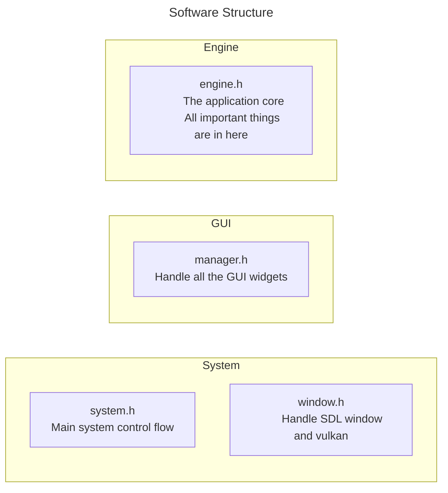
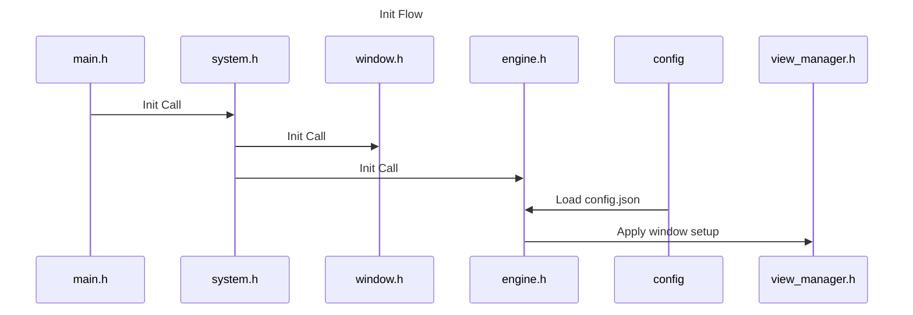
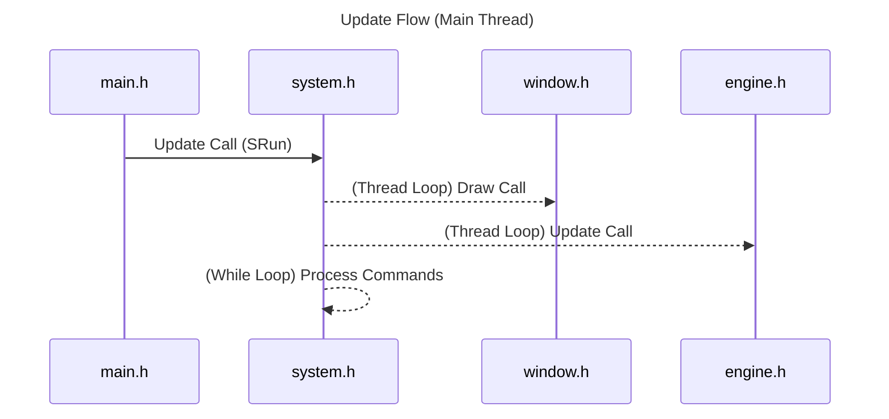

# January

My goal is createa a Touch designer alternative software.

## Feature

- [ ] Window management
- [ ] Custom project file
- [ ] 3D renderering
- [ ] 2D Renderering
- [ ] Node editor
- [ ] Shader compile in real-time
- [ ] Decklink SDK support
- [ ] Raw Websocket, HTTP, UDP, TCP Server/Client support
- [ ] Custom python-like script support (Multithread)

## CLI

You can use --help to check all the command usages.

### -v --verbose

Print detail information.

### -p --path

Project path target in the local machine.

## Structure

Software Structure shows the different region of the code

This is the init process flow\
It's trying to create all instance such as imgui window classes and config object\
And load the config setting from the local machine

This is the update process flow\
The graph only shows the main thread part.\
To prevent confusion.